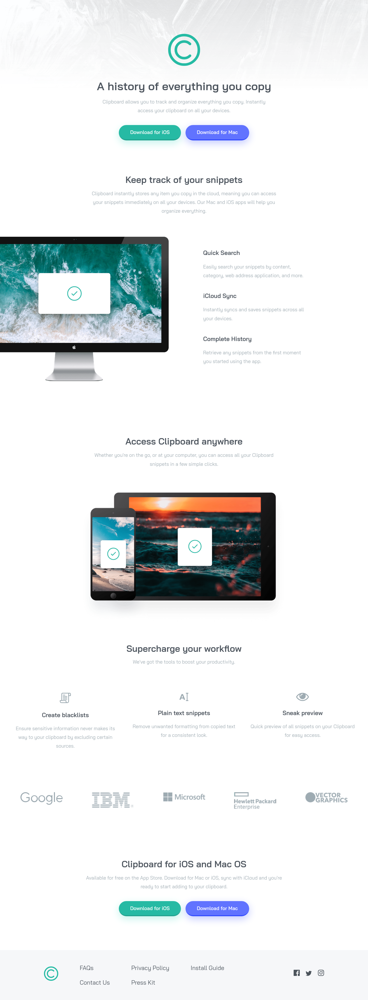

# Frontend Mentor - Clipboard landing page solution

This is a solution to the [Clipboard landing page challenge on Frontend Mentor](https://www.frontendmentor.io/challenges/clipboard-landing-page-5cc9bccd6c4c91111378ecb9). Took around three or four days to complete, I started rushing a bit towards the end since I wanted to move on to other projects.

## Table of contents

- [Overview](#overview)
  - [The challenge](#the-challenge)
  - [Screenshot](#screenshot)
  - [Links](#links)
- [My process](#my-process)
  - [Built with](#built-with)
  - [Useful resources](#useful-resources)
- [Author](#author)

## Overview

### The challenge

Users should be able to:

- View the optimal layout for the site depending on their device's screen size
- See hover states for all interactive elements on the page

### Screenshot

### Links

- [Solution](#)
- [Live Site](https://kharrnix.github.io/fem-clipboard-landing-page/)

## My process

### Built with

- Semantic HTML5 markup
- Flexbox
- CSS Grid
- Mobile-first workflow
- [React](https://reactjs.org/)

### Useful resources

- [Create React App docs](https://create-react-app.dev/docs/deployment/#github-pages) - This was useful for learning how to deploy to Github Pages

## Author

- [Gitlab](https://gitlab.com/kharrnix)
- [Frontend Mentor](https://www.frontendmentor.io/profile/kharrnix)
